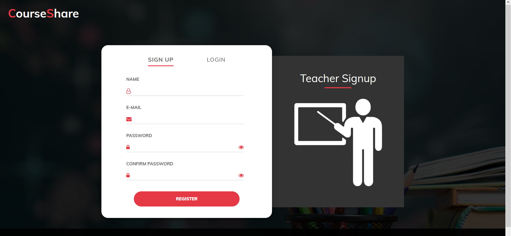
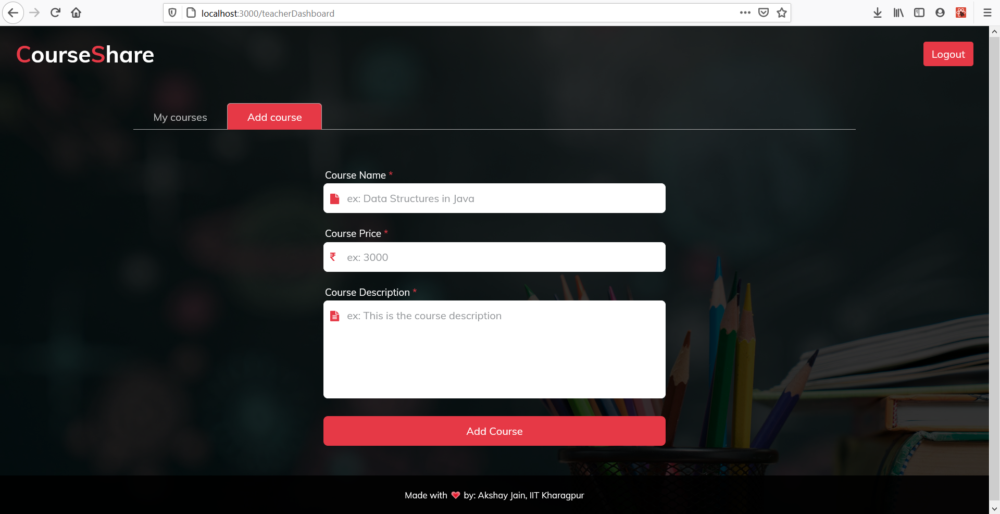

Developed a web/Android edutech marketplace where different creators can upload their courses which can be accessed by the registered students only. 

Made with :heart: by Amit, IIT Kharagpur

This repository contains frontend, backend and the database required for the app.

## About the app
It is a basic EdTech marketplace where course creators can share their courses with the registered students.
Course Creators (Teachers) can add/ remove courses after registering and the students can access those courses after successfull registration.

The code is divided into two parts, the frontend directory serves the frontend (using React), and the backend directory serves the backend (in Node/Express). 
`hackwebers.sql` is the database which contains different tables used in the app.

## Setup
1. Download and install the latest stable version of node.js if you haven't already from https://nodejs.org/en/download/
2. Download and install xampp from https://www.apachefriends.org/index.html
3. Clone the repository in your local machine.

## How to setup the Database
1. Open phpMyAdmin after configuring and starting the Apache and MySQL server in xampp
2. Click on import option and then select the `hackwebers.sql` file provided to import the complete database.

## How to run the Backend
1. In your terminal, navigate to the `backend` directory.
2. Run `npm install` to install all dependencies.
3. Run `node server` to start the app. (If everything is setup correctly, the console will show `Connected to database!`).

## How to run the Frontend
1. In another terminal, navigate to the `frontend` directory.
2. Run `npm install` to install all dependencies.
3. Run `npm start` to start the app. (If everything is setup correctly, a new browser tab will open at http://localhost:3000).

Here are some screenshots of the app:

